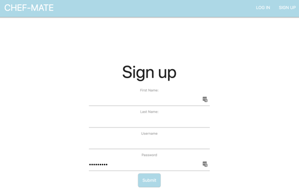
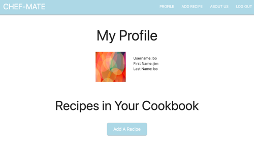
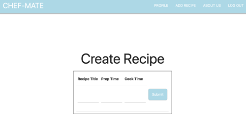
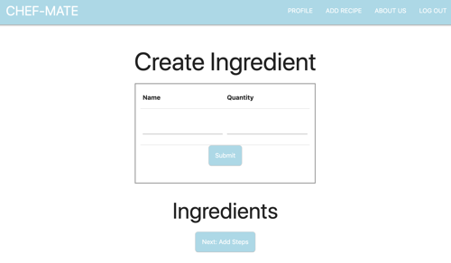
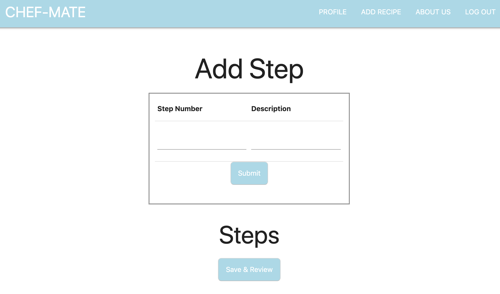
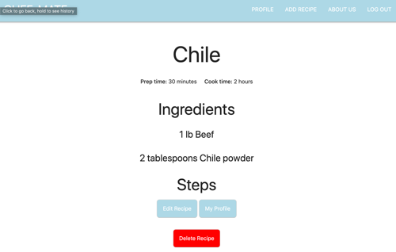
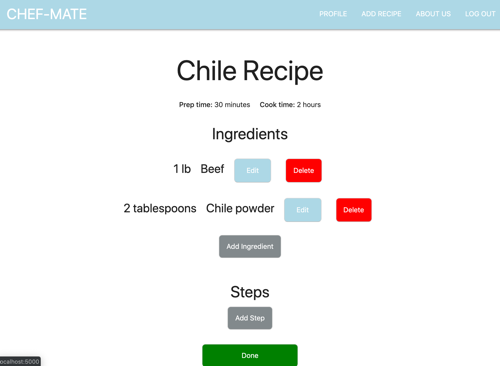
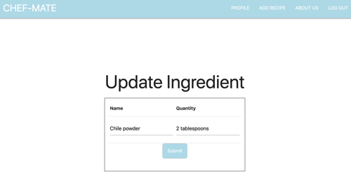

# Doubly Cooked

## table of contents
* [Documents](./documents)
* [Summary](#Summary)
* [Installation](#Installation)
* [Routes](#Routes)
* [Notes](#Notes)
* [Versions](#Versions)
* [Tests](#Tests)
* [Creators](#Creators)

## Summary

Doubly Cooked is a recipe app developed for the casual home cook. It stores recipes in the cloud that can be accessed from the profile page after logging in. Recipes can be added, edited and deleted. User names must be unique and passwords are hashed.
***

## Installation
To get this application up and running on your local machine, fork and/or clone this repository using the git clone command in your terminal.

Use PSQL to create a postgres database: CREATE DATABASE dbname

Add environment variables:
- DATABASE_URL

If required by your OS:
- DATABASE_USERNAME
- DATABASE_PASSWORD

Run RecipesApplication wich contains the main method. If the application successfully starts you will see these messages:
```
HHH000270: Type registration [java.util.UUID] overrides previous : 
Initialized JPA EntityManagerFactory for persistence unit 'default'
LiveReload server is running on port
Creating filter chain:
Initializing ExecutorService 'applicationTaskExecutor'
spring.jpa.open-in-view is enabled by default.
Adding welcome page template: index
Tomcat started on port(s): 5000 (http) with context path ''
Started RecipesApplication in 12.343 seconds (JVM running for 12.804)
```

At localhost:5000 the user will find the app splash page. Navigate to sign up.


At sign up enter first name, last name, a user name and a password. This will automagically take you to your profile page.



A new user won't have any recipes yet but will be able to add recipes from here or using the nav bar from anywhere in the app after logging in.



Adding a recipe has three steps. Step one is to give the recipe a name, a prep time, and a cook time then click submit.



The second step is to add ingredients. Each ingredient should have a name and quantity.



The third step is to add cooking steps. Start at step 1 and add instructions for each step.



When all ingredients and steps are added and Save-and-Review is clicked the review page will display the recipe. Here the user can edit or delete the recipe. Let's edit.



From the edit page ingredients and steps can be changed or deleted. Clicking Edit will bring up the edit form.



The edit form will have the item to be edited displayed. Modify as needed and click Submit. This will bring the user back to the edit page to confirm the change.


***

## Routes
### Fullstack App routes (routes using thymeleaf)
http://confirmation/id
- Page to review a recipe, after it is added, with options to edit or delete the recipe

http://recipe/edit/id
- Returns a form with all input fields prepopulated to allow user to edit a recipe

http://recipe/delete/id
- Delete route to remove a recipe, its ingredients and steps

http://recipe/aboutus
- About Us page

### Alexa routes (routes for Alexa only)
```GET``` Routes

```/alexa/recipes``` - Returns all the recipes that are created on Doubly

```/alexa/recipes/{title}``` - Returns the first recipe that is created in the app with a given title

```/alexa/recipes/{title}/cooktime``` - Returns the cook time that for a recipe with a specific title

```/alexa/recipes/{title}/preptime``` - Returns the prep time for a recipe with a specific title

```/alexa/recipes/{title}/ingredients``` - Returns the ingredients for a given recipe by title in JSON format

```/alexa/recipes/{title}/steps``` - Returns the steps for a given recipe by by title in JSON format
***
## Notes
### Alexa controller for recipe and Json response
```@JsonManagedReference``` and ```@JsonBackReference``` annotations were used to obtain JSON repsonses. This [stack overflow](https://stackoverflow.com/questions/47693110/could-not-write-json-infinite-recursion-stackoverflowerror-nested-exception) post was used
for setting up respective associations in the model

## Tests
[See the tests](src/test/java/tgreenidge/com/recipe_app/recipes/RecipesApplicationTests.java)

## Creators

- [Ed.Scott Abrahamsen](https://github.com/esa2)
- [Matt Burger](https://github.com/)
- [Paolo Chidrome](https://github.com/)
- [Tisha Greenidge](https://github.com/)
- [Jhia Turner](https://github.com/)
